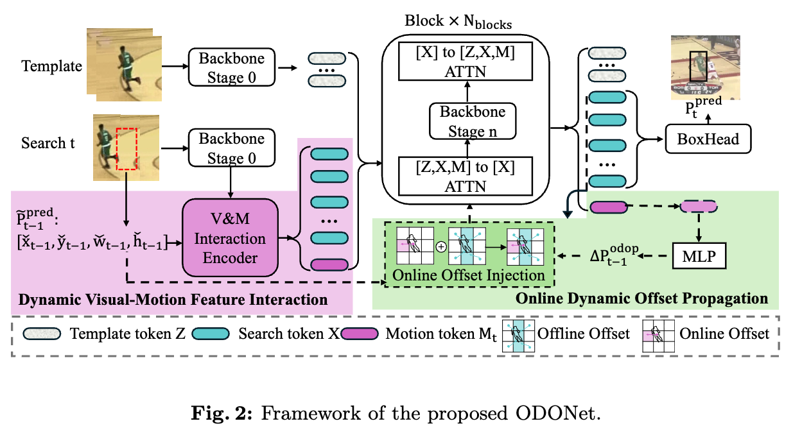
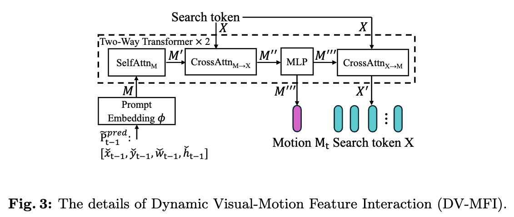
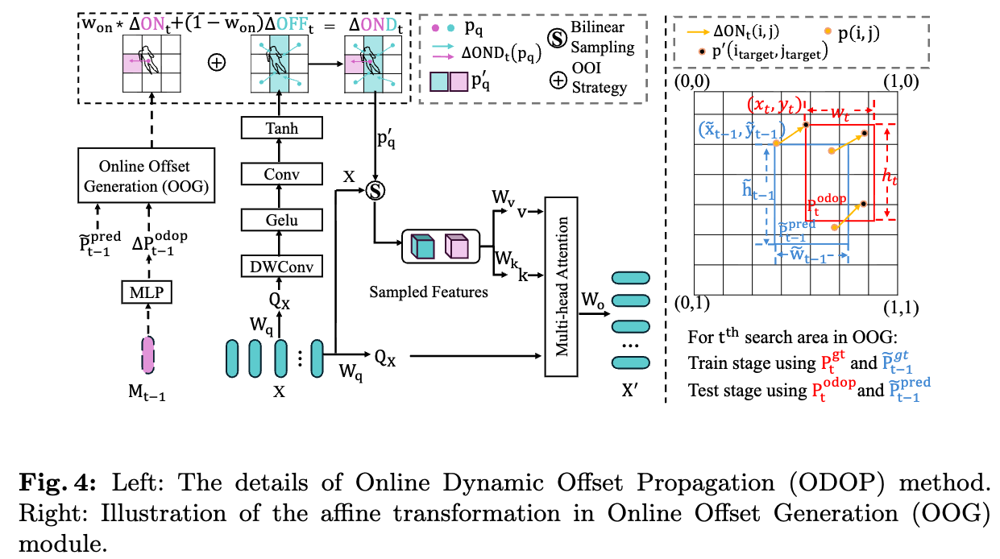

# ODONet
* # [ECCV'2026] - ODONet: Online Dynamic Offset Network for Visual Object Tracking
> **ODONet: Online Dynamic Offset Network for Visual Object Tracking**<br>
> Qinghua Liu, [Wanli Xue](https://scholar.google.com/citations?hl=zh-CN&user=2tjgi6MAAAAJ&view_op=list_works&sortby=pubdate), Shengyong Chen<br>
> Tianjin University of Technology &nbsp;·&nbsp; Qinghai Nationalities University

<!-- TODO: 论文公开后补充 arXiv / 项目主页链接与 PapersWithCode 徽章
[](https://arxiv.org/abs/XXXX.XXXXX)
[](https://paperswithcode.com/sota/visual-object-tracking-on-lasot)
[](https://paperswithcode.com/sota/visual-object-tracking-on-got-10k)
-->

[[Models and results in Baidu Netdisk](https://pan.baidu.com/s/1anUYtrKzDcYhXq9vkhu5lA?pwd=eu1r)] ,&nbsp;

[[Models and results in OneDrive](https://sx8bk-my.sharepoint.com/:f:/g/personal/lisushang_sx8bk_onmicrosoft_com/IgCCaZrozstCSq4JxUoWEeykAQCLPD6RVKfuLtC1RTIcFS8?e=joVldM)] ,&nbsp;


This is an official PyTorch implementation of the paper **ODONet: Online Dynamic Offset Network for Visual Object Tracking**.

ODONet is a Transformer-based tracker that, to our knowledge, is **the first to propagate dynamic offsets online**. It treats the target's historical bounding box as a *motion prompt*, fuses it with appearance features through a **Dynamic Visual–Motion Feature Interaction (DV-MFI)** module, and then explicitly models inter-frame displacement via an **Online Dynamic Offset Propagation (ODOP)** module that steers deformable attention toward an adaptive receptive field.

> **Note:** The current baseline is built on top of [MCITrack](https://github.com/kangben258/MCITrack) **with the Mamba blocks removed**. We recommend opening this project with PyCharm.


## Highlights

### :star2: Online dynamic offset propagation
Unlike existing *offline* offset methods (deformable convolution / deformable attention) that regenerate offsets independently at each frame and break temporal continuity, ODONet predicts an **online offset field** from historical motion and injects it into the current **offline offset field** through an **Online Offset Injection (OOI)** strategy. This yields *online dynamic offsets* that are continuous and history-aware, dynamically adjusting the receptive field along the target's motion trajectory.



### :star2: Dynamic Visual–Motion Feature Interaction (DV-MFI)
Inspired by SAM, DV-MFI embeds the normalized previous-frame bounding box into a sparse motion prompt and performs early cross-modal interaction through a **Two-Way Transformer**, producing motion-trend encodings enriched with appearance cues and visual features conditioned on motion dynamics.



### :star2: Online Dynamic Offset Propagation (ODOP)
ODOP generates an online offset field from the previous-frame motion encoding (via an affine transformation under the bounding-box rigidity assumption) and an offline offset field from current search features, then fuses them to guide motion-aware deformable feature sampling.



### :star2: Strong performance
ODONet achieves state-of-the-art results across both large-scale and small-scale benchmarks. The `GOT-10k*` column reports models trained on the GOT-10k train split only, following the one-shot protocol. A full SOTA comparison is provided in the paper.

#### Comparison with SOTA models
| Tracker            | LaSOT (AUC) | LaSOT_ext (AUC) | TrackingNet (AUC) | GOT-10k* (AO) |
|--------------------|:-----------:|:---------------:|:-----------------:|:-------------:|
| **ODONet-B384**    | **75.1**    | **53.1**        | **87.4**          | **81.4**      |
| **ODONet-B224**    | **74.6**    | **54.3**        | **86.3**          | **78.9**      |
| SPMTrack-B378      | 74.9        | -               | 86.1              | 76.5          |
| SUTrack-B384       | 74.4        | 52.9            | 86.5              | 79.3          |
| ARTrackV2-L384     | 73.6        | 53.4            | 86.1              | 79.5          |
| ODTrack-B384       | 73.2        | 52.4            | 85.1              | 77.0          |
| OSTrack-256        | 69.1        | 47.4            | 83.1              | 71.0          |

#### Comparison on TNL2K, UAV123 and VOT2020
| Tracker         | TNL2K (AUC) | UAV123 (AUC) | VOT2020 (EAO) |
|-----------------|:-----------:|:------------:|:-------------:|
| **ODONet-B384** | **63.1**    | **71.4**     | **61.5**      |
| **ODONet-B224** | **62.4**    | **71.1**     | **61.6**      |
| SeqTrack        | 56.4        | 68.6         | 56.1          |
| OSTrack         | 55.9        | 68.3         | 52.4          |
| MixFormer       | -           | 69.5         | 55.5          |

<sub>VOT2020 results use [Alpha-Refine](external/AR_VOT20) for pixel-level mask refinement.</sub>


## Install the environment
```
conda create -n odonet python=3.10
conda activate odonet
bash install.sh
```
Our experiments are conducted with **Python 3.10** and **PyTorch 2.7.1** (CUDA 12.6).

* Add the project path to environment variables
```
export PYTHONPATH=<absolute_path_of_ODONet>:$PYTHONPATH
```


## Data Preparation
Put the tracking datasets in `./data`. It should look like:
```
${ODONet_ROOT}
 -- data
     -- lasot
         |-- airplane
         |-- basketball
         |-- bear
         ...
     -- got10k
         |-- test
         |-- train
         |-- val
     -- coco
         |-- annotations
         |-- images
     -- trackingnet
         |-- TRAIN_0
         |-- TRAIN_1
         ...
         |-- TRAIN_11
         |-- TEST
     -- vasttrack
         |-- Zither
         |-- Zebra
         ...
```


## Set project paths
Run the following command to set paths for this project
```
python tracking/create_default_local_file.py --workspace_dir . --data_dir ./data --save_dir .
```
After running this command, you can also modify paths by editing these two files
```
lib/train/admin/local.py       # paths about training
lib/test/evaluation/local.py   # paths about testing
```
> **TODO:** `tracking/create_default_local_file.py` 目前为空文件，待补充自动生成脚本；当前可直接编辑上述两个 `local.py` 配置数据集与结果保存路径。


## Train
Download the pre-trained backbone weights **Fast-iTPN-B** (`fast_itpn_base_clipl_e1600.pt`) and put it under `./pretrained`.

<sub>Backbone weights are from [Fast-iTPN](https://github.com/sunsmarterjie/iTPN). &nbsp; **TODO:** 补充国内下载镜像链接。</sub>

### Train ODONet
```
# ODONet-B224 (full training set: LaSOT, GOT-10k, COCO, TrackingNet, VastTrack)
python -m torch.distributed.run --nproc_per_node 4 --master_port 12312 \
    lib/train/run_training.py --script odonet_v1 --config odonet_b224 --save_dir .

# ODONet-B384
python -m torch.distributed.run --nproc_per_node 4 --master_port 12312 \
    lib/train/run_training.py --script odonet_v1 --config odonet_b384 --save_dir .
```
For the GOT-10k one-shot protocol (train only on the GOT-10k train split):
```
python -m torch.distributed.run --nproc_per_node 4 --master_port 12312 \
    lib/train/run_training.py --script odonet_v1 --config odonet_b224_got --save_dir .
```
We train on **4 × RTX 3090** GPUs. The batch size, number of templates and learning-rate schedule are defined in the corresponding `experiments/odonet_v1/*.yaml` files (300 epochs / 100 for GOT-10k).


## Test and evaluate on benchmarks
Put the downloaded checkpoints under `./checkpoints/train/odonet_v1`.

- **LaSOT**
```
python tracking/test.py odonet_v1 odonet_b224 --dataset lasot --threads 2
python tracking/analysis_results.py   # modify tracker configs and names inside
```
- **LaSOT_ext**
```
python tracking/test.py odonet_v1 odonet_b224 --dataset lasot_extension_subset --threads 2
python tracking/analysis_results.py
```
- **GOT-10k-test**
```
python tracking/test.py odonet_v1 odonet_b224_got --dataset got10k_test --threads 2
python lib/test/utils/transform_got10k.py --tracker_name odonet_v1 --cfg_name odonet_b224_got
```
- **TrackingNet**
```
python tracking/test.py odonet_v1 odonet_b224 --dataset trackingnet --threads 2
python lib/test/utils/transform_trackingnet.py --tracker_name odonet_v1 --cfg_name odonet_b224
```
- **TNL2K**
```
python tracking/test.py odonet_v1 odonet_b224 --dataset tnl2k --threads 2
python tracking/analysis_results.py
```
- **UAV123**
```
python tracking/test.py odonet_v1 odonet_b224 --dataset uav --threads 2
python tracking/analysis_results.py
```
- **VOT2020** — uses Alpha-Refine for mask refinement; see [external/AR_VOT20](external/AR_VOT20) and [external/vot20](external/vot20).

> Replace `odonet_b224` with `odonet_b384` (and `odonet_b224_got` with `odonet_b384_got`) to evaluate the high-resolution variant.


## Test FLOPs, Params and Speed
```
python tracking/profile_odonet_model.py --script odonet_v1 --config odonet_b384
```


## Visualization and Visual Diagnosis Tool
ODONet ships an offset-field visualization that acts as a **dynamic diagnosis tool** for tracker behavior. It is built into the tracker — simply pass `--debug 1` to `tracking/test.py` to render, frame by frame, the search area, the `∆OND` offset field, and the predicted/history boxes (`--debug 2` instead saves each frame with the predicted box drawn):
```
python tracking/test.py odonet_v1 odonet_b224 --dataset lasot --sequence <sequence_name> --threads 0 --debug 1
```
- **Local analysis:** the `∆OND` offset field points toward a distractor one frame *before* the bounding box drifts, giving an early warning of drift direction.
- **Global analysis:** the Gram matrix of the offset field exhibits sharp peaks that align with frame-wise performance drops, serving as an *unsupervised* indicator of tracking failure.


## Citation
If you find ODONet useful for your research, please consider citing:
Will be updated in future.

[//]: # ()
[//]: # (```)

[//]: # (@inproceedings{liu2026odonet,)

[//]: # (  title={ODONet: Online Dynamic Offset Network for Visual Object Tracking},)

[//]: # (  author={Liu, Qinghua and Xue, Wanli and Chen, Shengyong},)

[//]: # (  booktitle={ECCV},)

[//]: # (  year={2026})

[//]: # (})

[//]: # (```)


## Acknowledgement
This codebase is built upon [MCITrack](https://github.com/kangben258/MCITrack) and [OSTrack](https://github.com/botaoye/OSTrack). The DV-MFI module is inspired by [SAM](https://github.com/facebookresearch/segment-anything), the deformable-attention sampling follows [DAT](https://github.com/LeapLabTHU/DAT), and the backbone is [Fast-iTPN](https://github.com/sunsmarterjie/iTPN). We thank the authors for their excellent work.


## Contact
* Qinghua Liu (email: liuqinghua@stud.tjut.edu.cn)